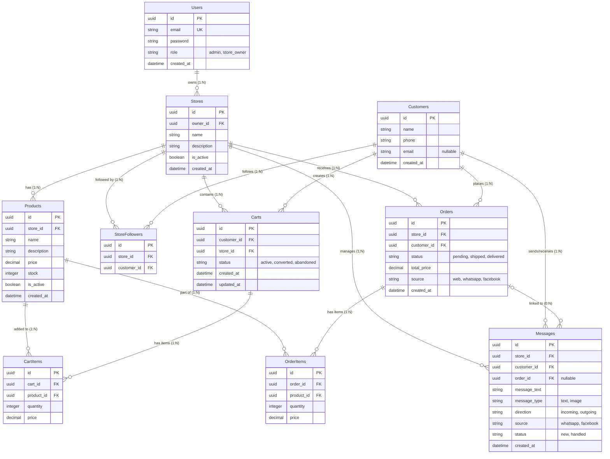

# SaaS Marketplace (Mapp) + Social Commerce ERD

This document contains the production-level Entity-Relationship Diagram (ERD) and architecture details for your multi-tenant SaaS Social Commerce platform.

## Mermaid ER Diagram

## Schema Domains & Groupings

### 1. Core (Multi-Tenant Administration)
- **`Users`**: Admin or store owners. Authenticates platform and tenant management access.
- **`Stores`**: Tenants on your platform. Includes basic tenant metadata. `owner_id` establishes which user controls it.

### 2. Marketplace 
- **`Customers`**: The end consumer layer. They are global across the application (multi-tenant marketplace concept) so they can buy from any store.
- **`StoreFollowers`**: Tracks customer affinity mapping to stores. Enables marketplace-style feeds and targeted marketing.

### 3. Commerce (Catalogs & Fulfillment)
- **`Products`**: Catalog elements strictly isolated directly to a single `Stores` tenant via `store_id`.
- **`Carts`**: Simplified for the MVP by enforcing a `store_id` parameter. Ensures customers cannot create complex multi-seller checkouts reducing transaction overhead and vendor routing.
- **`CartItems`**: Tied to `Carts`, maps specific quantities of `Products` ready for order projection.
- **`Orders` & `OrderItems`**: The final commercial receipt. Tracks total price, statuses, and links specifically to individual stores and customers.

### 4. Social / AI Context
- **`Messages`**: Ties conversations from WhatsApp/FB directly to a `store_id` and a `customer_id`. Can be optionally linked to a specific `order_id` if a question or custom request initiates an order. 
- *Future AI Readines*: Structuring this manually with specific explicit sources (`message_type`, `direction`, `source`) pre-optimizes for an AI service or LLM ingestion engine (such as LangChain/RAG architectures that contextualize previous order history alongside live WhatsApp text streams).

## Scalability & Production Indices
Use standard B-Tree indexing effectively, especially as SaaS tables swell rapidly across multiple tenants. Note that clustered indices matter for UUID architectures (Use sequential/v7 UUIDs if possible on insert-heavy large models to stop fragmentation).

**Key Index Locations:**
* Every table should have an index on `store_id` (Tenant isolating filtering is the most frequent query).
* **Queries**: Composite index on `Messages (store_id, customer_id, created_at)` for highly efficient timeline reconstructions and fast query loading of inbox feeds.
* **Filter Opts**: Single index everywhere on `is_active` for Shops and Products.
* **Order Analysis**: Index on `Orders(store_id, status)` + `Orders(source)` for rapid merchant dashboard insights.
